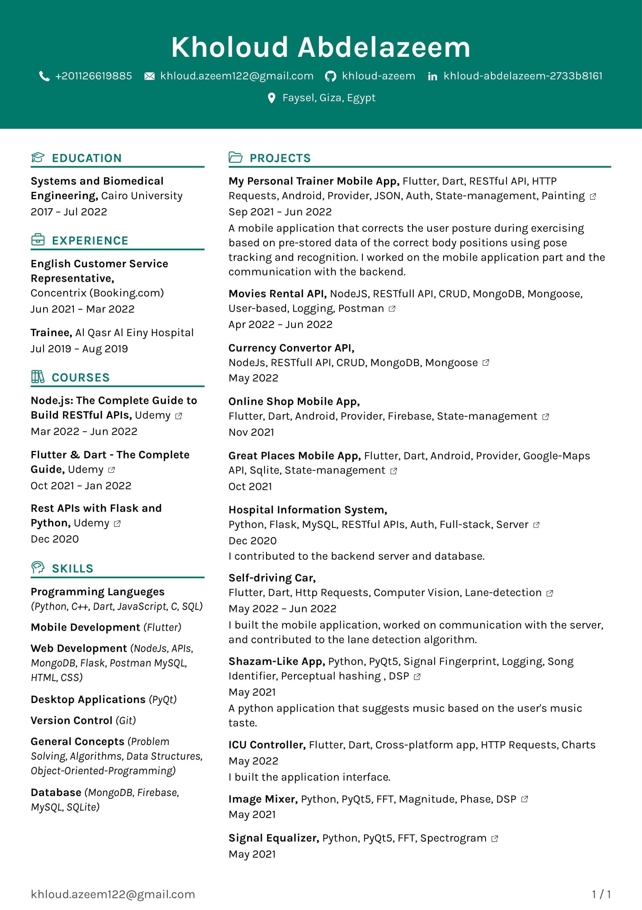

### Hi there 👋

# Khloud Abdelazeem Mostafa

- ⚡ I'm a Biomedical engineer and I love coding. 
- 🔭 Intrested in Software development. 
- 🌱 I'm currently learning Flutter.
- 📫 How to reach me: khloud.azeem122@gmail.com

## 📝 Resume 

--------

## 🛠 Languages & Technologies

<code></code>
<code></code>
<code></code>
<code></code>
<code></code>
<code></code>
<code></code>
<code></code>
<code></code>
<code></code>

